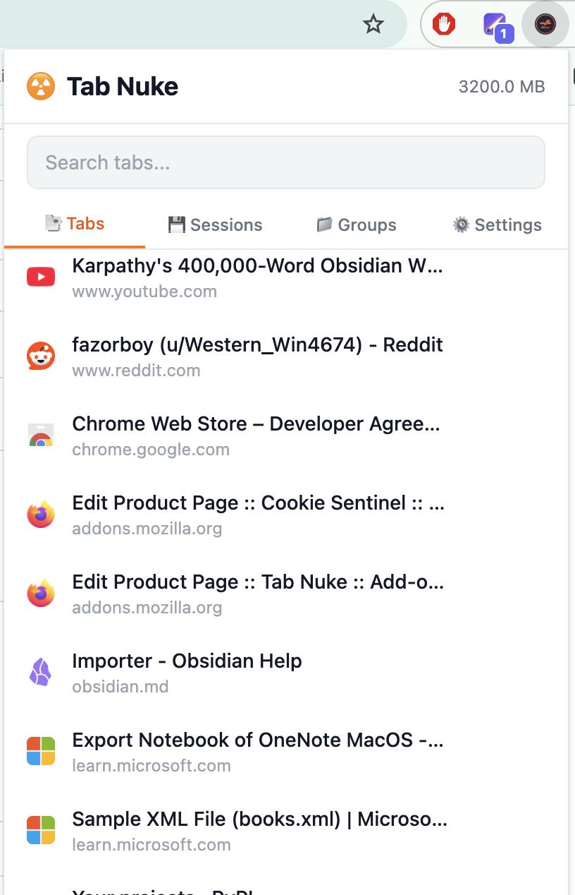
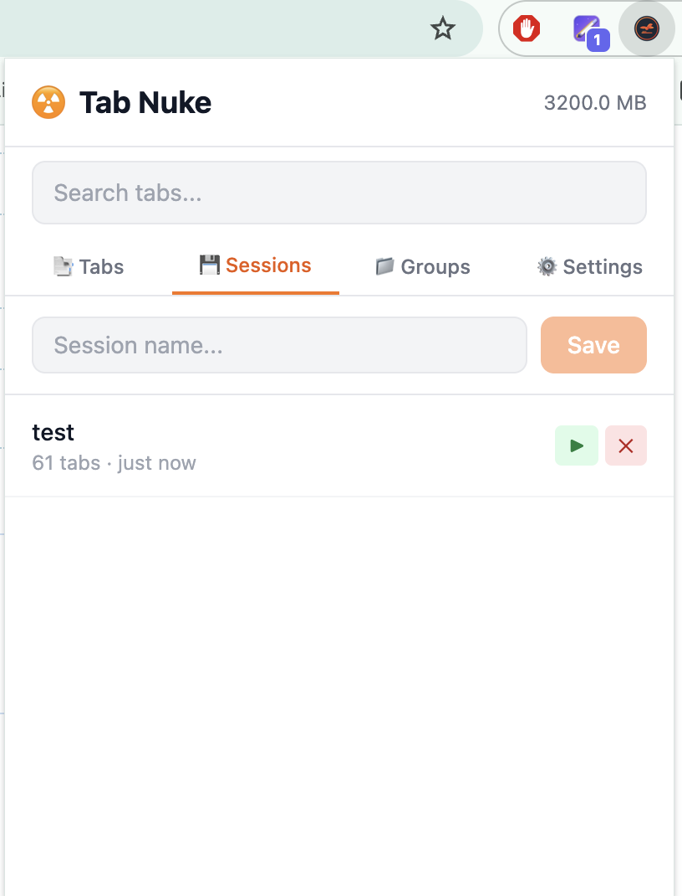
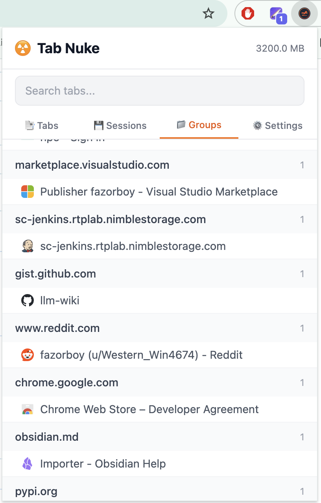
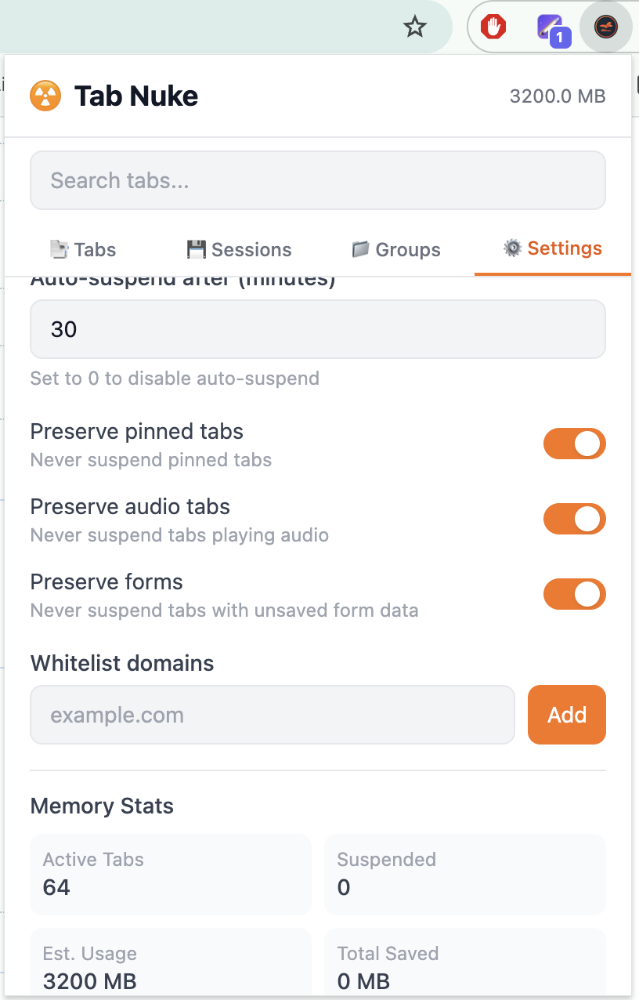

  

<h1 align="center">Tab Nuke</h1>

  Smart tab manager that tames your browser. 
  <strong>Auto-suspend · Session save · Focus mode · Memory dashboard</strong>

  
  
  
  
  = 18" />
  
  

---

## Features

| Feature | Description |
|---------|-------------|
| **Auto-Suspend** | Hibernates inactive tabs after configurable timeout, freeing memory |
| **Smart Grouping** | Groups tabs by domain with one click |
| **Session Save/Restore** | Save all tabs as a named session, restore later |
| **Focus Mode** | Close all tabs except current domain — restore them later |
| **Memory Dashboard** | Track memory usage and savings from suspended tabs |
| **Tab Search** | Fuzzy search across all open and suspended tabs |
| **Keyboard Shortcuts** | Quick actions via configurable shortcuts |
| **Dark Mode** | Follows system preference |

## Comparison

| Feature | Tab Nuke | OneTab | The Great Suspender |
|---------|----------|--------|---------------------|
| Auto-suspend | ✅ | ❌ | ✅ (discontinued) |
| Tab grouping | ✅ | ❌ | ❌ |
| Session save | ✅ | ✅ | ❌ |
| Focus mode | ✅ | ❌ | ❌ |
| Memory stats | ✅ | ❌ | ❌ |
| Fuzzy search | ✅ | ❌ | ❌ |
| Manifest V3 | ✅ | ❌ | ❌ |
| Privacy-first | ✅ | ⚠️ | ❌ |
| Open source | ✅ | ❌ | ❌ |

## Install

### Chrome / Edge

1. Download the latest release ZIP from [Releases](https://github.com/tab-nuke/tab-nuke/releases)
2. Go to `chrome://extensions` (or `edge://extensions`)
3. Enable "Developer mode"
4. Click "Load unpacked" and select the extracted folder

### Firefox

1. Download the latest `.xpi` from [Releases](https://github.com/tab-nuke/tab-nuke/releases)
2. Go to `about:addons`
3. Click the gear icon → "Install Add-on From File"
4. Select the `.xpi` file

## Usage

### Quick Actions

- **Suspend All** — Suspends all tabs except the active one
- **Restore All** — Restores all suspended tabs
- **Focus Mode** — Closes all tabs except those on the current domain

### Keyboard Shortcuts

| Shortcut | Action |
|----------|--------|
| `Alt+S` | Suspend current tab |
| `Alt+Shift+S` | Suspend all other tabs |
| `Alt+F` | Toggle focus mode |
| `Alt+T` | Search tabs |

### Configuration

Open the extension popup → Settings tab to configure:

- Auto-suspend timeout (0 to disable)
- Whitelisted domains
- Pinned tab protection
- Audio tab protection
- Form data protection

## Screens
## Screens

  
  

  
  

## Security

- **Zero tracking** — No analytics, no external requests
- **URL validation** — All URLs sanitized before tab operations
- **XSS prevention** — Dynamic content uses `textContent`, never `innerHTML`
- **Minimal permissions** — Only `tabs`, `tabGroups`, `storage`, `alarms`, `scripting`
- **Local storage** — All data stored locally in the browser

## Contributing

See [CONTRIBUTING.md](docs/CONTRIBUTING.md) for development guidelines.

## License

[MIT](LICENSE) — free to use, modify, and distribute.
